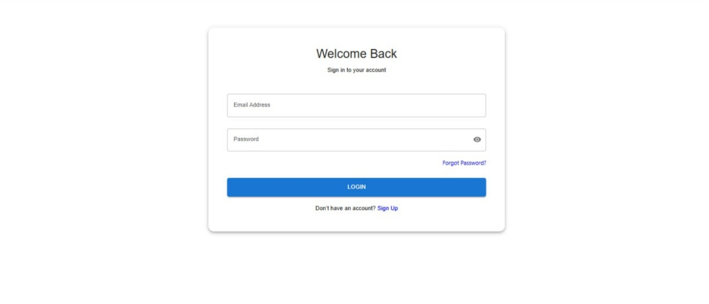
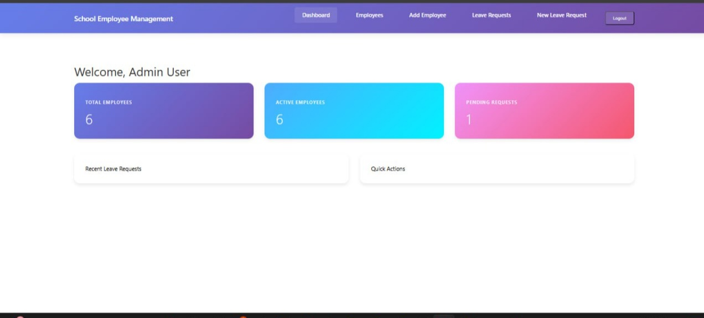
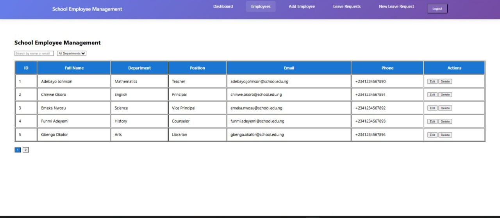
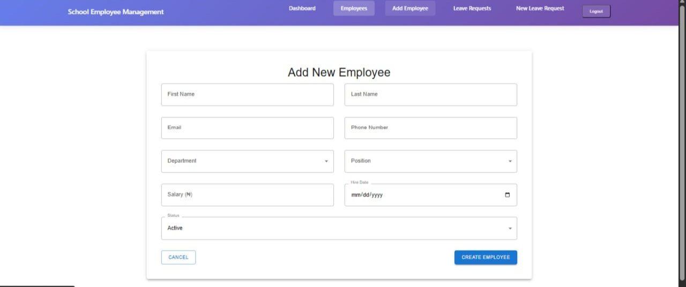
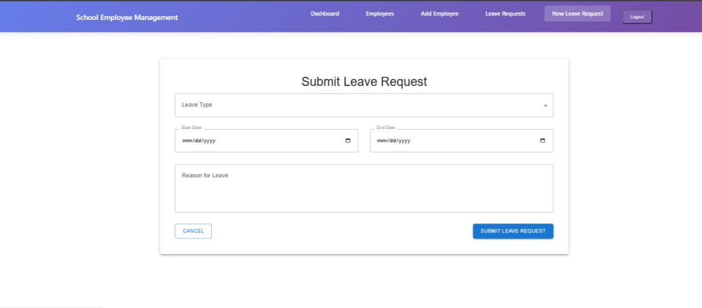

Project Title & Description
# School Employee Management System

A frontend web application for managing school staff records efficiently.
Live Link Section 
https://school-employee-management-system-1.vercel.app/dashboard
## 📄 Documentation
School Employee Management System Documentation

Introduction
The School Employee Management System is a web-based application that helps schools manage employee records easily. It allows administrators to add, view, update, and delete staff information in one place.

Purpose
The purpose of this system is to reduce paperwork and make employee management faster, more organized, and more accurate.

Main Features
User login for secure access
Add new employee records
View all employees
Edit employee information
Delete employee records
Simple and easy-to-use interface

Technologies Used
React (Create React App)
React Router DOM
Material UI (MUI)
Axios
JSON Server (mock backend)
GitHub and Vercel

How to Run the Project
1. Install Node.js on your computer

2. Clone the project from GitHub

3. Run npm install

4. Start the app with npm start

5. Start the backend with npm run server

Conclusion
The School Employee Management System is a simple and effective solution for managing school staff records. It helps schools save time, keep accurate data, and improve overall efficiency.
## Screenshots

### Login Page

### Homepage

### Employee List

### Employee Form

### Leave Form

### Presentation Slides
[Download Presentation Slides](./School-Employee-Management-System.pdf)

### Colour Palette

The following colours were used in the frontend design:

- Primary Blue: #1976D2
- Dark Blue: #0D47A1
- White: #FFFFFF
- Light Grey: #F5F5F5
- Text Black: #212121
